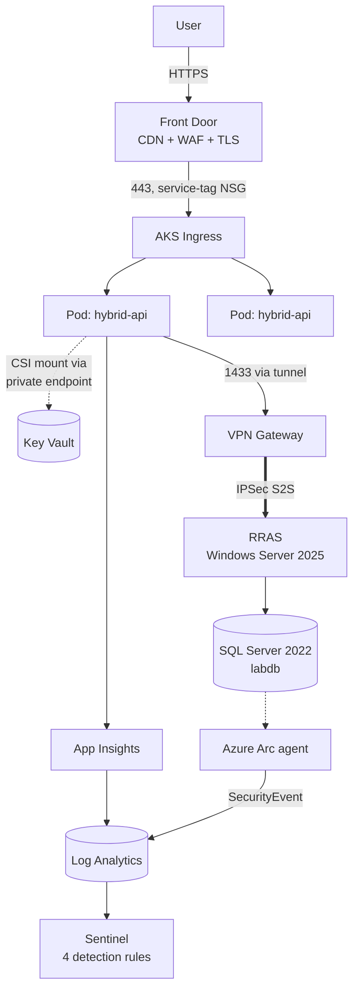
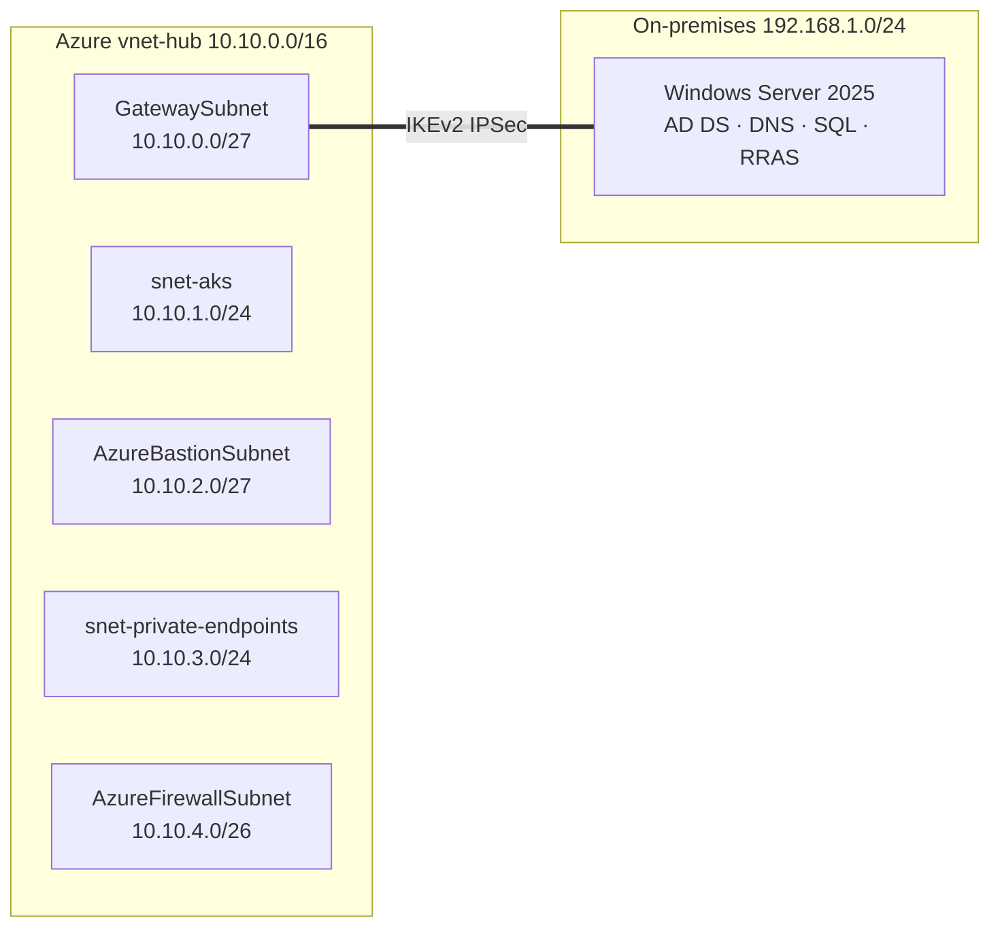
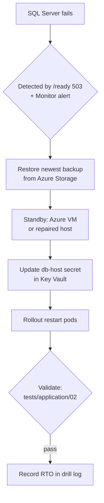
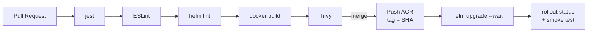

# Architecture Diagrams (GitHub renders these natively)

## Full request + data flow

```mermaid
flowchart TB
    U[User] -->|HTTPS| FD[Front Door<br/>CDN + WAF + TLS]
    FD -->|443, service-tag NSG| ING[AKS Ingress]
    ING --> P1[Pod: hybrid-api]
    ING --> P2[Pod: hybrid-api]
    P1 -.->|CSI mount via<br/>private endpoint| KV[(Key Vault)]
    P1 -->|1433 via tunnel| VPN[VPN Gateway]
    VPN ==>|IPSec S2S| RRAS[RRAS<br/>Windows Server 2025]
    RRAS --> SQL[(SQL Server 2022<br/>labdb)]
    P1 --> AI[App Insights]
    AI --> LAW[(Log Analytics)]
    ARC[Azure Arc agent] -->|SecurityEvent| LAW
    LAW --> SENT[Sentinel<br/>4 detection rules]
    SQL -.-> ARC
```

## Network topology

```mermaid
flowchart LR
    subgraph Azure["Azure vnet-hub 10.10.0.0/16"]
        GW[GatewaySubnet<br/>10.10.0.0/27]
        AKS[snet-aks<br/>10.10.1.0/24]
        BAS[AzureBastionSubnet<br/>10.10.2.0/27]
        PE[snet-private-endpoints<br/>10.10.3.0/24]
        FW[AzureFirewallSubnet<br/>10.10.4.0/26]
    end
    subgraph OnPrem["On-premises 192.168.1.0/24"]
        WS[Windows Server 2025<br/>AD DS · DNS · SQL · RRAS]
    end
    GW ===|IKEv2 IPSec| WS
```

## DR failover flow

```mermaid
flowchart TB
    A[SQL Server fails] --> B{Detected by /ready 503<br/>+ Monitor alert}
    B --> C[Restore newest backup<br/>from Azure Storage]
    C --> D[Standby: Azure VM<br/>or repaired host]
    D --> E[Update db-host secret<br/>in Key Vault]
    E --> F[Rollout restart pods]
    F --> G{Validate:<br/>tests/application/02}
    G -->|pass| H[Record RTO in drill log]
```

## CI/CD pipeline

```mermaid
flowchart LR
    PR[Pull Request] --> T[jest] --> L[ESLint] --> HL[helm lint] --> DB[docker build] --> TR[Trivy]
    TR -->|merge| ACR[Push ACR<br/>tag = SHA]
    ACR --> HU[helm upgrade --wait]
    HU --> RS[rollout status<br/>+ smoke test]
```
